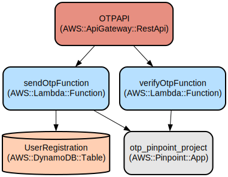

# Phone Number Verification System with AWS Amplify and OTP

A secure phone number verification system that uses AWS Amplify to send and verify one-time passwords (OTP) via SMS. The system provides a user-friendly interface for phone verification and rewards successful verification with a downloadable resource.

This project combines AWS services (Pinpoint, API Gateway, Lambda) with a React frontend to create a robust verification flow. It features rate limiting, secure OTP handling, and a responsive UI built with Cloudscape Design Components. The system supports international phone numbers and implements best practices for OTP verification including validity periods and attempt limits.

## Repository Structure
```
.
├── amplify/                      # AWS Amplify backend configuration and functions
│   ├── backend.ts               # Defines AWS infrastructure (API Gateway, DynamoDB, Pinpoint)
│   └── functions/               # Lambda functions for OTP operations
│       └── src/
│           ├── sendOtp.ts      # Lambda function to generate and send OTP
│           └── verifyOtp.ts    # Lambda function to verify submitted OTP
├── src/                         # Frontend React application
│   ├── App.tsx                 # Main application component
│   ├── phoneVerification.tsx   # Phone verification form component
│   └── main.tsx               # Application entry point with Amplify configuration
└── package.json                # Project dependencies and scripts
```

## Usage Instructions
### Prerequisites
- Node.js 16.x or later
- AWS Account with appropriate permissions
- AWS Amplify Gen2 CLI installed globally (`npm install -g @aws-amplify/cli@latest`)
- AWS CLI configured with valid credentials

### Installation
```bash
# Clone the repository
git clone <repository-url>

# Install dependencies
npm install

# Install Amplify backend dependencies
cd amplify && npm install

# Initialize Amplify Gen2 backend
amplify init
```

### Quick Start
1. Deploy the backend infrastructure:
```bash
# From the amplify directory
amplify push
```

2. After successful deployment, the CLI will generate an `amplify_outputs.json` file in your project root. This file contains the necessary configuration for your frontend.

3. Start the development server:
```bash
npm run dev
```

4. Access the application at `http://localhost:5173`

### More Detailed Examples
#### Phone Verification Flow
```typescript
// Submit phone number
const sendOTP = async (phoneNumber: string) => {
  const response = await post({
    apiName: "otpAPI",
    path: 'otp',
    options: {
      body: { phoneNumber }
    }
  });
};

// Verify OTP
const verifyOTP = async (phoneNumber: string, otp: string) => {
  const response = await post({
    apiName: "otpAPI",
    path: 'validate',
    options: {
      body: { phoneNumber, otp }
    }
  });
};
```

### Troubleshooting
#### Common Issues
1. OTP Not Received
   - Verify phone number format includes country code (+1XXXXXXXXXX)
   - Check AWS Pinpoint logs in CloudWatch
   - Ensure phone number is not in the suppression list

2. API Gateway Errors
   - Check CORS settings in `amplify/backend.ts`
   - Verify API endpoints in Amplify configuration
   - Enable debug logging: Set `AWS_AMPLIFY_LOG_LEVEL='DEBUG'`

#### Debug Mode
```typescript
// Enable debug logging in your application
Amplify.Logger.LOG_LEVEL = 'DEBUG';

// Check CloudWatch logs
aws logs get-log-events --log-group-name /aws/lambda/sendOtp --log-stream-name <stream>
```

## Data Flow
The system implements a two-step verification process using AWS services for secure OTP handling.

```ascii
[Frontend] ----phoneNumber----> [API Gateway] -----> [Lambda sendOtp] -----> [Pinpoint]
                                                          |
                                                          v
[Frontend] <---OTP SMS------ [User Phone] <----- [SMS Service] <----- [Pinpoint]
    |
    |----OTP Code-----> [API Gateway] -----> [Lambda verifyOtp] -----> [Pinpoint]
    |                                              |
    <----Signed URL----- [API Gateway] <----------/
```

Key Component Interactions:
1. Frontend collects phone number and sends to API Gateway
2. Lambda function validates phone number and triggers Pinpoint
3. Pinpoint sends OTP via SMS to user's phone
4. User submits OTP through frontend
5. Verification Lambda validates OTP with Pinpoint
6. Success response includes signed URL for resource download
7. Error responses include specific failure reasons
8. All requests are rate-limited and logged

## Infrastructure


### API Gateway
- REST API named "otpAPI" with two endpoints:
  - POST /otp: Sends OTP
  - POST /validate: Verifies OTP
- Configured with throttling (100 req/s, burst 50)
- CORS enabled for all origins (customize for production)

### Lambda Functions
- sendOtpFunction: Generates and sends OTP
- verifyOtpFunction: Validates submitted OTP

### DynamoDB
- Table: UserRegistration
  - Partition Key: phone_number (String)
  - Pay-per-request billing mode

### Pinpoint
- Project: otp_pinpoint_project
- Configured for SMS messaging
- OTP validity period: 15 minutes
- Maximum 3 verification attempts